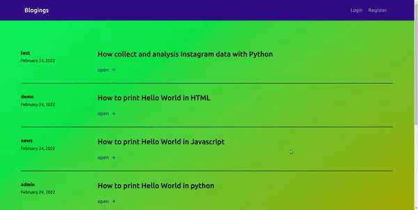

# Blogings

It is a full stack blogging Application

## Live App

[Live App](https://blogings.vercel.app/)

## Stack

### Backend

- Typescript
- Express
- FireBase
  - FireStore
  - Authentication

### Frontend

- Javascript
- React
- Tailwindcss

### Project Structure

```
.
├── backend
│   ├── firebase.json
│   ├── functions
│   │   ├── app.yaml
│   │   ├── package.json
│   │   ├── package-lock.json
│   │   ├── Procfile
│   │   ├── src
│   │   │   ├── helper
│   │   │   │   └── validators.ts
│   │   │   ├── index.ts
│   │   │   ├── interfaces
│   │   │   │   ├── blog.interface.ts
│   │   │   │   ├── blogs.interface.ts
│   │   │   │   └── user.interface.ts
│   │   │   ├── services
│   │   │   │   ├── blogs.ts
│   │   │   │   └── users.ts
│   │   │   └── util
│   │   │       ├── admin.ts
│   │   │       ├── auth.ts
│   │   │       └── config.ts
│   │   └── tsconfig.json
│   └── README.md
├── demo
│   └── demo.gif
├── deploy_backend.sh
├── frontend
│   ├── package.json
│   ├── package-lock.json
│   ├── public
│   │   ├── favicon.ico
│   │   ├── index.html
│   │   └── robots.txt
│   ├── README.md
│   ├── src
│   │   ├── App.js
│   │   ├── App.test.js
│   │   ├── components
│   │   │   ├── Card.js
│   │   │   ├── Cards.js
│   │   │   ├── Footer.js
│   │   │   ├── Header.js
│   │   │   ├── Post.js
│   │   │   └── Spinner.js
│   │   ├── index.css
│   │   ├── index.js
│   │   ├── pages
│   │   │   ├── Create.js
│   │   │   ├── Edit.js
│   │   │   ├── Home.js
│   │   │   ├── Login.js
│   │   │   ├── Me.js
│   │   │   ├── Profile.js
│   │   │   └── Register.js
│   │   ├── reportWebVitals.js
│   │   ├── setupTests.js
│   │   └── util.js
│   └── tailwind.config.js
└── README.md

```

## Demo



## Setup Local

- Clone this Repository

### Backend Setup

- Go [Firebase Console](https://firebase.google.com/)
- Create New Project
- Setup Firebase Functions

```bash
cd backend/functions
```

- Install Dependency

```bash
npm install
```

- Start Local using emulator

```bash
npm run serve
```

## Frontend setup

```bash
cd frontend
```

- install Dependencies

```bash
npm install
```

- Start Dev Server

```bash
npm run start
```

## Thank You
